# AsyncDelay — User Guide

**Package:** `com.hridoy.asyncdelay` &nbsp;|&nbsp; **Version:** v1.0.0 &nbsp;|&nbsp; **Min API:** 14 &nbsp;|&nbsp; **Size:** 30.36 KB  
**Last Updated:** June 5, 2026

---

## What is AsyncDelay?

AsyncDelay is a high-performance asynchronous execution engine for MIT App Inventor 2. It solves one of the most common pain points in App Inventor development: **doing things at the right time, without freezing your app.**

Out of the box, App Inventor's Clock component is limited — it can't run multiple timers independently, it has no debounce or throttle logic, and scheduling a sequence of actions requires messy nesting. AsyncDelay replaces all of that with a clean, unified toolkit.

**What you can do with AsyncDelay:**

- Run code after a delay without blocking your UI
- Create multiple named interval loops that run independently
- Wait for a condition to become true before continuing
- Retry failed network calls automatically with smart backoff
- Prevent buttons from firing too quickly (debounce & throttle)
- Coordinate multiple async tasks and know when they've all finished
- Schedule a series of timed steps in sequence

---

## All Blocks
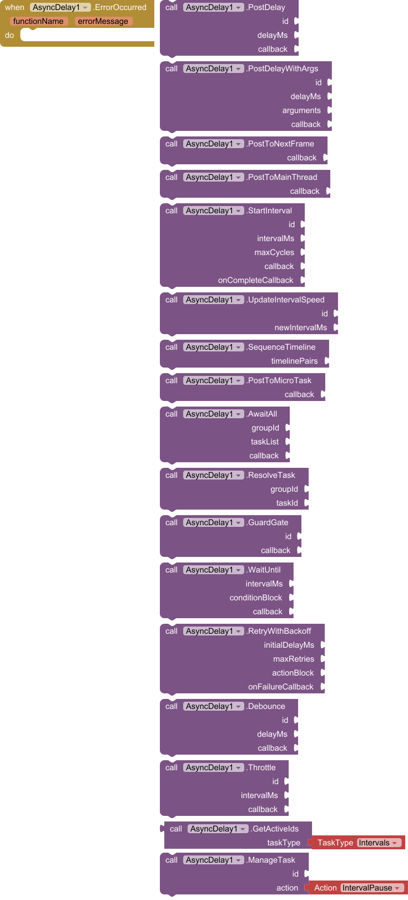

## Quick Reference

| Method | What it does |
|---|---|
| `PostDelay` | Run code once, after a delay |
| `PostDelayWithArgs` | Run code once after a delay, passing in values |
| `StartInterval` | Repeat code on a timer (like a named Clock) |
| `UpdateIntervalSpeed` | Change the speed of a running interval |
| `SequenceTimeline` | Run a list of steps, each with its own delay |
| `WaitUntil` | Poll a condition, then act when it's true |
| `RetryWithBackoff` | Retry a failing task with increasing wait times |
| `Debounce` | Wait for input to stop before acting |
| `Throttle` | Limit how often an action can fire |
| `AwaitAll` + `ResolveTask` | Run a callback when multiple tasks all finish |
| `GuardGate` | Block or allow code paths using named gates |
| `PostToMainThread` | Update UI safely from a background process |
| `PostToNextFrame` | Sync an action to the next screen render |
| `PostToMicroTask` | Yield control, letting layouts render first |
| `ManageTask` | Pause, resume, or cancel any active task |
| `GetActiveIds` | List all currently running tasks of a given type |
| `GetRunningIntervalIds` | List all active interval loop IDs |

---

## Event

### ErrorOccurred
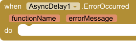

Fires whenever an asynchronous operation throws a runtime exception. Connect this event to a label or notifier to surface errors during development — it's your safety net across all async operations.

| Parameter | Type | Description |
|---|---|---|
| `functionName` | text | The method where the error occurred |
| `errorMessage` | text | A description of what went wrong |

---

## Methods

---

### 1. PostDelay
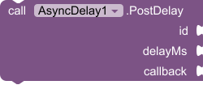

Schedules a block of code to run on the main thread after a specified number of milliseconds. Use this any time you want to "do something later" without blocking the screen.

- Leave `id` empty (`""`) for a simple fire-and-forget delay.
- Provide a unique `id` to make the delay **cancellable and overwritable** — calling `PostDelay` with the same ID again resets the timer.

**Callback parameters:** none

| Parameter | Type | Description |
|---|---|---|
| `id` | text | Unique name for this delay, or `""` for anonymous |
| `delayMs` | number | Wait time in milliseconds |
| `callback` | any | The procedure to run after the delay |

<details>
<summary><strong>Example — Show a welcome message 2 seconds after the screen opens</strong></summary>

**Scenario:** You want a toast notification to appear two seconds after `Screen1` initializes, giving layouts time to render before drawing attention.

**Block logic:**
```
when Screen1.Initialize
  call AsyncDelay.PostDelay
    id: ""
    delayMs: 2000
    callback: (procedure
                 call Notifier1.ShowMessageDialog
                   message: "Welcome! Swipe left to get started."
                   title: "👋 Hello"
                   buttonText: "OK"
              )
```

**Why not just use Clock?** You'd have to enable the Clock, handle the Tick event, then immediately disable the Clock again. `PostDelay` does all of that in one block, with no cleanup needed.

</details>

---

### 2. PostDelayWithArgs
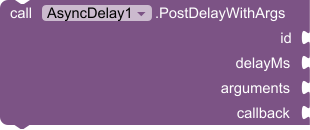

Like `PostDelay`, but lets you pass a list of values into the callback. The values are **captured at the moment of the call** — even if the variables change later, the callback receives the original values.

**Callback parameters:** one parameter per item in your `arguments` list, in the same order.

| Parameter | Type | Description |
|---|---|---|
| `id` | text | Unique name, or `""` for anonymous |
| `delayMs` | number | Wait time in milliseconds |
| `arguments` | list | Values to pass into the callback |
| `callback` | any | Procedure that receives those values |

<details>
<summary><strong>Example — Animate a series of labels fading in one after another</strong></summary>

**Scenario:** You have three labels (`Label1`, `Label2`, `Label3`) and want each one to appear 300 ms after the previous, all launched from a loop. Without argument capture, a loop variable would change before the callbacks fire.

**Block logic:**
```
// Loop i from 1 to 3
for each i from 1 to 3 step 1
  call AsyncDelay.PostDelayWithArgs
    id: ""
    delayMs: (i × 300)
    arguments: (make a list: i)
    callback: (procedure [index]
                 set (select list item list: labelList index: index).Visible to true
              )
```

Because the argument list is frozen at call time, `index` inside the callback will correctly be `1`, `2`, then `3` even though `i` has already moved on.

</details>

---

### 3. PostToNextFrame


Queues a callback to run at the very start of the next hardware display frame. Use this when you've made layout changes and need to read back a component's updated size or position — the values won't be correct until the frame has been calculated.

**Callback parameters:** none

| Parameter | Type | Description |
|---|---|---|
| `callback` | any | Procedure to run on the next frame |

<details>
<summary><strong>Example — Read a label's width after dynamically setting its text</strong></summary>

**Scenario:** You update a label's text and then need to know its rendered width to position another element next to it. Reading `Label1.Width` immediately after setting the text gives you the *old* width — you need to wait one frame.

**Block logic:**
```
set Label1.Text to "Dynamic Content"

call AsyncDelay.PostToNextFrame
  callback: (procedure
               set Image1.X to (Label1.Width + 8)
            )
```

</details>

---

### 4. PostToMainThread


Schedules a block to run on the main UI thread. This is essential when you're receiving data from a background process (such as a Web component response or a Bluetooth listener) and need to update a label, button, or layout safely.

**Callback parameters:** none

| Parameter | Type | Description |
|---|---|---|
| `callback` | any | Procedure to run on the UI thread |

<details>
<summary><strong>Example — Update a label after receiving a Web response</strong></summary>

**Scenario:** Your app fetches live weather data. The response handler may fire on a background thread — directly updating UI components from there can cause crashes or visual glitches.

**Block logic:**
```
when Web1.GotText
  call AsyncDelay.PostToMainThread
    callback: (procedure
                 set LabelTemperature.Text to (call JsonParser.getTemperature responseContent)
                 set LabelTemperature.Visible to true
              )
```

</details>

---

### 5. StartInterval
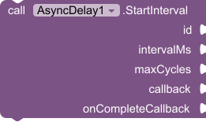

Creates a named, repeating timer loop identified by a unique `id`. Unlike a Clock component, you can run many of these simultaneously and manage each one independently.

- Set `maxCycles` to `0` for an infinite loop.
- The `callback` receives the current cycle number (starting at 1) on every tick.
- The `onCompleteCallback` fires once when `maxCycles` is reached. It never fires for infinite loops.

| Parameter | Type | Description |
|---|---|---|
| `id` | text | Unique name for this interval |
| `intervalMs` | number | Time between ticks in milliseconds |
| `maxCycles` | number | How many times to run (`0` = infinite) |
| `callback` | any | Procedure run on every tick; receives `currentCycle` |
| `onCompleteCallback` | any | Procedure run when the loop finishes |

<details>
<summary><strong>Example — Countdown timer that updates a label and shows "Time's up!" when done</strong></summary>

**Scenario:** A quiz app needs a 10-second countdown. Each second the label updates, and when the countdown finishes a dialog appears.

**Block logic:**
```
call AsyncDelay.StartInterval
  id: "quizCountdown"
  intervalMs: 1000
  maxCycles: 10
  callback: (procedure [currentCycle]
               set LabelTimer.Text to join (10 - currentCycle) "s remaining"
            )
  onCompleteCallback: (procedure
                         call Notifier1.ShowMessageDialog
                           message: "Time's up! Moving to the next question."
                           title: "⏰"
                           buttonText: "OK"
                      )
```

To stop the timer early (e.g. the user answers before time runs out):
```
call AsyncDelay.ManageTask
  id: "quizCountdown"
  action: IntervalCancel
```

</details>

---

### 6. UpdateIntervalSpeed
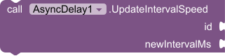

Changes the tick rate of an already-running interval without stopping it or resetting the cycle count. Useful for animations that need to speed up or slow down dynamically.

| Parameter | Type | Description |
|---|---|---|
| `id` | text | ID of the running interval to modify |
| `newIntervalMs` | number | New time between ticks in milliseconds |

<details>
<summary><strong>Example — Speed up a loading animation as a task nears completion</strong></summary>

**Scenario:** A spinner animation runs at 200 ms per frame normally, but you want it to accelerate to 80 ms when the app knows the loading is almost done.

**Block logic:**
```
// When upload reaches 80%
when ProgressBar1.Progress > 80
  call AsyncDelay.UpdateIntervalSpeed
    id: "spinnerLoop"
    newIntervalMs: 80
```

</details>

---

### 7. SequenceTimeline


Executes a chain of timed steps from a structured list. Each item in the list is a two-item sub-list: `[delayMs, callbackProcedure]`. Steps fire in order, each one waiting `delayMs` milliseconds after the previous step finishes.

The callback receives `currentIndex` — the position of the currently running step.

| Parameter | Type | Description |
|---|---|---|
| `timelinePairs` | list | A list of `[delayMs, procedure]` pairs |

<details>
<summary><strong>Example — Animate an onboarding intro sequence</strong></summary>

**Scenario:** When a new user opens the app for the first time, you want to reveal UI elements one at a time with pauses between them for visual impact.

**Block logic:**
```
call AsyncDelay.SequenceTimeline
  timelinePairs: (make a list:
    (make a list: 0    (procedure [i] set LabelWelcome.Visible to true))
    (make a list: 800  (procedure [i] set LabelTagline.Visible to true))
    (make a list: 600  (procedure [i] set ButtonGetStarted.Visible to true))
    (make a list: 400  (procedure [i] call AnimationUtils.fadeIn ButtonGetStarted))
  )
```

Each step waits for the previous one plus its own `delayMs` before firing.

</details>

---

### 8. PostToMicroTask


Yields execution to the bottom of the current message queue — lower priority than `PostToNextFrame`. Use this when you need layouts to fully render before your code continues, without tying execution to a specific frame cycle.

**Callback parameters:** none

| Parameter | Type | Description |
|---|---|---|
| `callback` | any | Procedure to run after yielding |

<details>
<summary><strong>Example — Read layout dimensions after a dynamic arrangement change</strong></summary>

**Scenario:** You programmatically change the number of columns in a `TableArrangement` and then need to measure child widths. A microtask yield lets the layout pass complete first.

**Block logic:**
```
set TableArrangement1.Columns to 3

call AsyncDelay.PostToMicroTask
  callback: (procedure
               set globalCellWidth to (TableArrangement1.Width / 3)
            )
```

</details>

---

### 9. AwaitAll
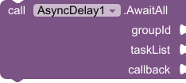

Sets up a group that waits for multiple named tasks to all complete before running a final callback. You define the task IDs upfront; each task calls `ResolveTask` when it finishes. The `callback` fires automatically once every task in the group has resolved.

**Callback parameters:** none

| Parameter | Type | Description |
|---|---|---|
| `groupId` | text | Unique name for this group |
| `taskList` | list | List of task ID strings to wait for |
| `callback` | any | Procedure to run when all tasks resolve |

<details>
<summary><strong>Example — Wait for user profile, settings, and inventory to all load before showing the home screen</strong></summary>

**Scenario:** Your app loads three independent data sources on startup. You want to show the home screen only after all three are ready.

**Block logic:**
```
call AsyncDelay.AwaitAll
  groupId: "appStartup"
  taskList: (make a list: "profileLoaded" "settingsLoaded" "inventoryLoaded")
  callback: (procedure
               call Screen1.navigateTo HomeScreen
            )

// In your profile fetch success handler:
call AsyncDelay.ResolveTask  groupId: "appStartup"  taskId: "profileLoaded"

// In your settings fetch success handler:
call AsyncDelay.ResolveTask  groupId: "appStartup"  taskId: "settingsLoaded"

// In your inventory fetch success handler:
call AsyncDelay.ResolveTask  groupId: "appStartup"  taskId: "inventoryLoaded"
```

The home screen only opens after all three `ResolveTask` calls have been made, in any order.

</details>

---

### 10. ResolveTask
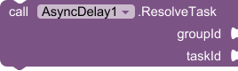

Marks a specific task inside an `AwaitAll` group as complete. When all tasks in the group have been resolved, the group's callback fires automatically.

| Parameter | Type | Description |
|---|---|---|
| `groupId` | text | The ID of the `AwaitAll` group this task belongs to |
| `taskId` | any | The ID of the task being marked complete |

*See the `AwaitAll` example above for a complete usage pattern.*

---

### 11. GuardGate
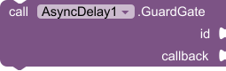

Only allows the callback to execute if the gate with the given `id` is currently **open**. If the gate is locked, the callback is silently dropped. Gates start unlocked by default; use `ManageTask` with `GateLock` / `GateUnlock` to control them.

**Callback parameters:** none

| Parameter | Type | Description |
|---|---|---|
| `id` | text | The gate identifier to check |
| `callback` | any | Procedure to run if the gate is open |

<details>
<summary><strong>Example — Prevent duplicate form submissions</strong></summary>

**Scenario:** A user taps a "Submit" button. You want to prevent the submit logic from running again while the request is in flight.

**Block logic:**
```
// Lock the gate as soon as submit starts
call AsyncDelay.ManageTask  id: "submitGate"  action: GateLock

call AsyncDelay.GuardGate
  id: "submitGate"   // This will now be locked — subsequent taps are dropped
  callback: (procedure
               call Web1.PostText url: apiUrl text: formData
            )

// In Web1.GotText (response received):
call AsyncDelay.ManageTask  id: "submitGate"  action: GateUnlock
```

The gate blocks any rapid re-taps while waiting for a server response, and re-opens automatically once the response arrives.

</details>

---

### 12. WaitUntil
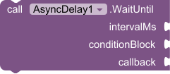

Repeatedly polls a condition block at the specified interval. The moment the condition returns `true`, the callback fires. The condition block receives `checkCount` — how many times it has been checked so far.

Use this to wait for something you don't control: a Bluetooth connection, a variable set by another component, or an asset that loads asynchronously.

| Parameter | Type | Description |
|---|---|---|
| `intervalMs` | number | How often to check the condition (ms) |
| `conditionBlock` | any | Procedure returning `true` or `false`; receives `checkCount` |
| `callback` | any | Procedure to run once the condition is true |

<details>
<summary><strong>Example — Wait for a Bluetooth device to connect before sending data</strong></summary>

**Scenario:** The user taps "Connect," and your app waits for `BluetoothClient.IsConnected` to become true before sending an initialization command.

**Block logic:**
```
call AsyncDelay.WaitUntil
  intervalMs: 500
  conditionBlock: (procedure [checkCount]
                    return BluetoothClient1.IsConnected
                  )
  callback: (procedure
               call BluetoothClient1.SendText text: "INIT"
               set LabelStatus.Text to "Device ready"
            )
```

The check runs every 500 ms and stops automatically once connected — no manual cleanup required.

</details>

---

### 13. RetryWithBackoff
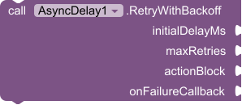

Runs an action and, if it fails, retries it after an increasing delay (exponential backoff). The first retry waits `initialDelayMs`, the second waits `initialDelayMs × 2`, the third waits `initialDelayMs × 4`, and so on. If all retries are exhausted, `onFailureCallback` fires.

The `actionBlock` receives `currentRetry` (starting at 1). To signal a failure and trigger a retry, call the retry trigger from inside the action block.

| Parameter | Type | Description |
|---|---|---|
| `initialDelayMs` | number | Wait time before the first retry |
| `maxRetries` | number | Maximum number of attempts |
| `actionBlock` | any | Procedure to attempt; receives `currentRetry` |
| `onFailureCallback` | any | Procedure to run if all retries fail |

<details>
<summary><strong>Example — Retry a failed API request up to 4 times</strong></summary>

**Scenario:** Your app posts data to a server. Network conditions are unreliable, so you want to retry automatically with spacing between attempts rather than hammering the endpoint.

**Block logic:**
```
call AsyncDelay.RetryWithBackoff
  initialDelayMs: 1000
  maxRetries: 4
  actionBlock: (procedure [currentRetry]
                 set LabelStatus.Text to join "Attempt " currentRetry "..."
                 call Web1.PostText url: apiUrl text: payload
                 // In Web1.GotText, if response code is not 200 → trigger retry
               )
  onFailureCallback: (procedure
                        set LabelStatus.Text to "Upload failed after 4 attempts. Check your connection."
                      )
```

Retry delays will be: 1 s → 2 s → 4 s → 8 s.

</details>

---

### 14. Debounce
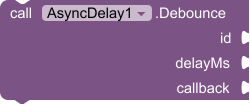

Delays a callback until input has **stopped** for `delayMs` milliseconds. Every time the debounced call is triggered, the timer resets. The callback fires only once, after the burst of input ends.

Classic use case: search-as-you-type — you don't want to fire a server query on every keystroke, only when the user pauses.

**Callback parameters:** none

| Parameter | Type | Description |
|---|---|---|
| `id` | text | Unique name for this debounce |
| `delayMs` | number | Silence period before the callback fires |
| `callback` | any | Procedure to run after input pauses |

<details>
<summary><strong>Example — Search a database only after the user stops typing</strong></summary>

**Scenario:** A search box queries a local SQLite database. Querying on every character change is wasteful — debouncing waits until the user finishes typing.

**Block logic:**
```
when TextBox1.TextChanged
  call AsyncDelay.Debounce
    id: "searchDebounce"
    delayMs: 400
    callback: (procedure
                 call DatabaseSearch TextBox1.Text
              )
```

If the user types "hello" quickly, only one database call is made — 400 ms after the last keystroke.

</details>

---

### 15. Throttle
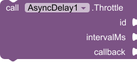

Limits an action to fire **at most once per interval window**. Unlike debounce (which waits for input to stop), throttle lets the first call through immediately and then silently drops any calls that arrive within the window.

Use throttle for buttons, scroll events, or sensor readings where you want regular updates but not an overwhelming flood.

**Callback parameters:** none

| Parameter | Type | Description |
|---|---|---|
| `id` | text | Unique name for this throttle |
| `intervalMs` | number | Minimum time between allowed executions |
| `callback` | any | Procedure to run when the window is open |

<details>
<summary><strong>Example — Prevent a "Like" button from being spammed</strong></summary>

**Scenario:** A social feed has a heart button. You want it to register at most once every 2 seconds, no matter how fast the user taps.

**Block logic:**
```
when ButtonLike.Click
  call AsyncDelay.Throttle
    id: "likeThrottle"
    intervalMs: 2000
    callback: (procedure
                 call Web1.PostText url: likeEndpoint text: postId
                 set ButtonLike.Image to "heart_filled.png"
              )
```

</details>

---

### 16. GetActiveIds


Returns a list of currently tracked task IDs filtered by type. Use this to inspect the state of your app's async operations at runtime — handy for debugging or for building pause-all / cancel-all functionality.

**Returns:** list

| Parameter | Type | Options |
|---|---|---|
| `taskType` | TaskType | `Intervals`, `Delays`, `Debounces`, `Throttles`, `LockedGates` |

<details>
<summary><strong>Example — Cancel all pending delays when navigating away from a screen</strong></summary>

```
when Screen1.BackPressed
  set pendingDelays to call AsyncDelay.GetActiveIds taskType: Delays
  for each delayId in pendingDelays
    call AsyncDelay.ManageTask
      id: delayId
      action: DelayCancel
```

</details>

---

### 17. ManageTask
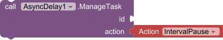

A unified control panel for managing the lifecycle of any active async operation. Pass in the target `id` and the action to perform.

| Parameter | Type | Description |
|---|---|---|
| `id` | text | ID of the task to manage |
| `action` | Action | One of the supported actions below |

**Supported Actions:**

| Action | What it does |
|---|---|
| `IntervalPause` | Freezes an interval loop without losing the cycle count |
| `IntervalResume` | Resumes a paused interval |
| `IntervalCancel` | Permanently stops and removes an interval |
| `DebounceCancel` | Cancels a pending debounced callback |
| `ThrottleCancel` | Releases a throttle lock immediately |
| `DelayCancel` | Cancels a scheduled `PostDelay` or `PostDelayWithArgs` |
| `GateLock` | Closes a guard gate — future `GuardGate` calls with this ID are dropped |
| `GateUnlock` | Opens a guard gate — future `GuardGate` calls with this ID pass through |

<details>
<summary><strong>Example — Pause and resume a game loop when the app goes to background</strong></summary>

**Scenario:** Your game runs its physics and rendering on an interval called `"gameLoop"`. When the user leaves the app (screen loses focus), you pause it. When they return, you resume.

**Block logic:**
```
when Screen1.OtherScreenClosed
  call AsyncDelay.ManageTask  id: "gameLoop"  action: IntervalPause

when Screen1.Initialize
  call AsyncDelay.ManageTask  id: "gameLoop"  action: IntervalResume
```

The cycle count is preserved across the pause — the loop continues exactly where it left off.

</details>

---

## Glossary

| Term | Meaning |
|---|---|
| **Callback** | A procedure block passed into a method, called automatically when the time or condition is right |
| **Debounce** | Delay execution until input stops — fires once after a burst |
| **Throttle** | Allow execution at most once per time window — drops extra calls |
| **Backoff** | Increasing delay between retries to avoid overwhelming a server |
| **Gate** | A named on/off switch that controls whether a block of code is allowed to run |
| **AwaitAll** | A coordination pattern that waits for multiple independent tasks to finish |
| **Frame** | A single rendering pass of the Android display — typically ~16 ms at 60 fps |
| **Main Thread** | The UI thread; all component property changes must happen here |

---

## Tips & Best Practices

**Always give intervals a meaningful ID.** IDs like `"healthBar"`, `"countdownTimer"`, and `"syncLoop"` are far easier to debug than `"timer1"` or `"loop"`.

**Use debounce for text input, throttle for buttons.** Debounce waits for the user to stop — throttle just slows the rate. They solve different problems.

**Connect `ErrorOccurred` during development.** Route it to a visible label or `Notifier` so exceptions surface immediately rather than silently disappearing.

**Use `AwaitAll` instead of nesting delays.** Deeply nested `PostDelay` chains are hard to read and maintain. `AwaitAll` + `ResolveTask` expresses the same intent far more clearly.

**`PostToMainThread` before touching UI from Web responses.** Even if it seems to work without it, updating UI from a non-main thread is undefined behavior on Android and can cause intermittent crashes on real devices.
